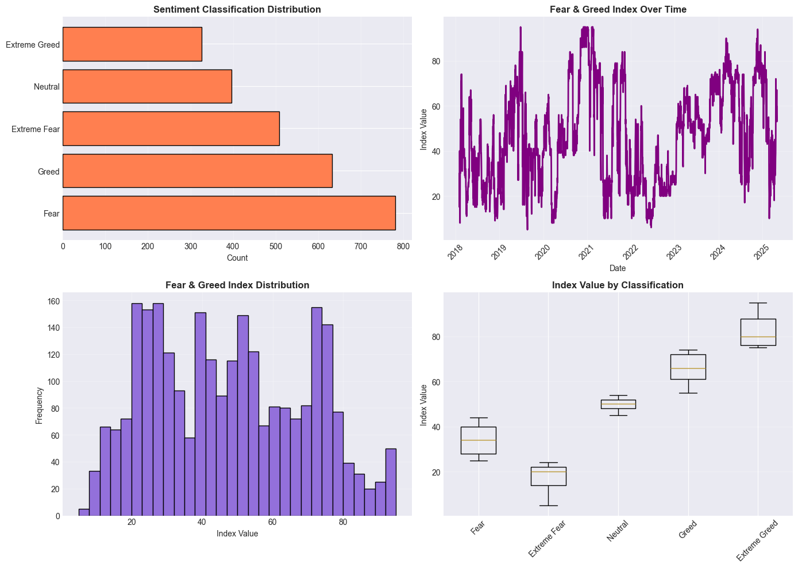
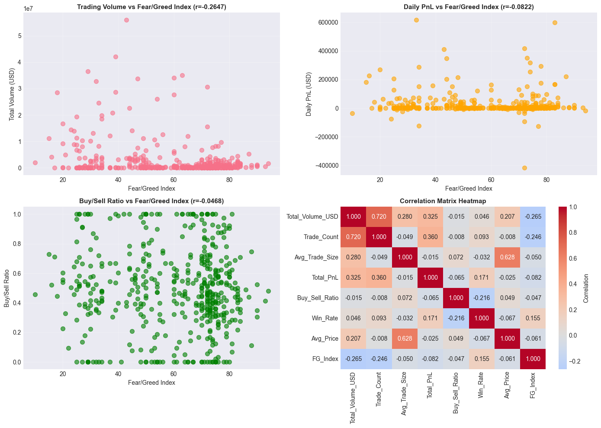
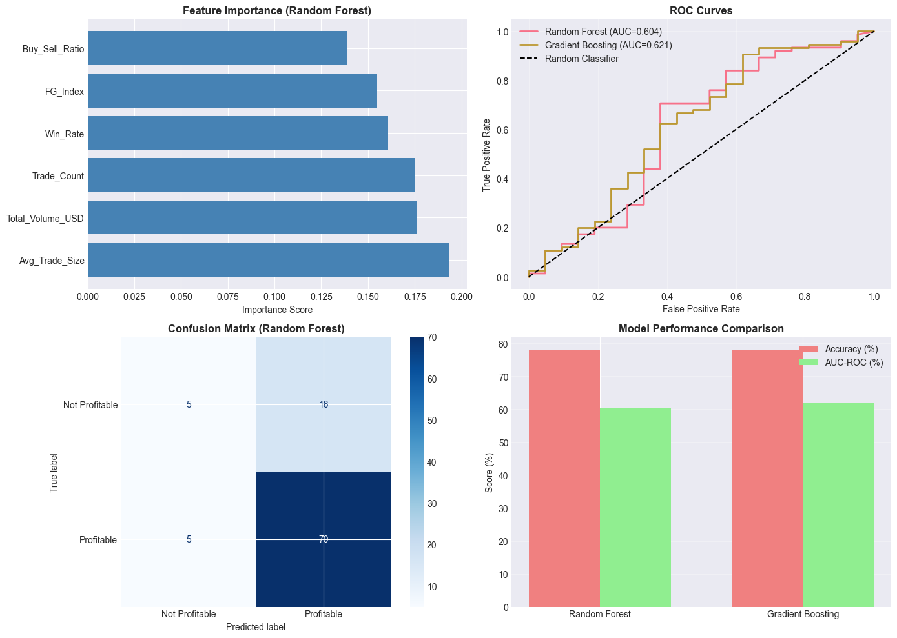

# 📊 Trader Sentiment Analysis - Project Documentation

## Project Overview
This project analyzes the relationship between trader activity and market sentiment (Fear/Greed Index).  
It provides comprehensive insights into trading patterns and develops actionable strategy recommendations  
based on quantitative analysis of historical trading data and sentiment indicators.

**Project Status:** Active Analysis  
**Last Updated:** February 2026  
**Analysis Framework:** Python (Pandas, NumPy, Scikit-learn, Matplotlib, Seaborn)

---

# 📂 Data Sources

## 1️⃣ Historical Trading Data (`historical_data.csv`)
- **Records:** 211,224 trading transactions  
- **Trading Days Aggregated:** 480  
- **Time Period Covered:** May 2023 – May 2025  
- **Total Volume:** $1,191,187,442.46  
- **Total Fees Paid:** $245,857.72  

### 📌 Key Performance Metrics
- **Total Portfolio P&L:** $10,296,958.94  
- **Net Profit (After Fees):** $10,051,101.22  
- **Average Daily P&L:** $21,452.00  
- **Daily P&L Std Dev:** $71,861.46  
- **Win Rate (Profitable Days):** 75.42%  
- **Profit Factor:** 10.27x  
- **Average Trade Size:** $6,141.75  

---

## 2️⃣ Fear & Greed Index (`fear_greed_index.csv`)
- **Records:** 2,644 daily observations  
- **Date Range:** February 2018 – May 2025  
- **Index Range Observed:** 5 – 95  
- **Mean Index:** 46.98  
- **Standard Deviation:** 21.83  

### Sentiment Distribution
- Fear: 781  
- Greed: 633  
- Extreme Fear: 508  
- Neutral: 396  
- Extreme Greed: 326  

---

# 🔬 Methodology

## Data Cleaning
- Removed 0 duplicate transactions  
- Standardized IST datetime  
- Converted numeric fields  
- Forward-filled sentiment values  
- Final merged dataset: 480 trading days  

## Feature Engineering
- Position_Size_Ratio  
- Buy_Flag  
- Profitable (Daily target variable)  
- Fee_Ratio  
- Daily Aggregations (Volume, P&L, Win Rate, Buy/Sell Ratio)  

## Analysis Approach
1. Exploratory Data Analysis  
2. Daily Aggregation of trading + sentiment  
3. Statistical & Correlation Analysis  
4. Strategy Development  
5. Predictive Modeling  

---

# 📈 Visualizations

## 1️⃣ Distribution & Trading Trends

File: `1_Distribution_and_Trends.png`

Includes:
- Trade size distribution  
- P&L distribution  
- Daily trading activity trends  
- Sentiment distribution patterns  



---

## 2️⃣ Correlation Analysis

File: `Correlation_Plot.png`

### Pearson Correlation with Fear/Greed Index

| Feature | Correlation |
|----------|------------|
| Win_Rate | **+0.1547** |
| Buy_Sell_Ratio | -0.0468 |
| Avg_Trade_Size | -0.0496 |
| Avg_Price | -0.0611 |
| Total_PnL | -0.0822 |
| Trade_Count | -0.2458 |
| Total_Volume_USD | **-0.2647** |

- **Strongest Positive Correlation:** Win_Rate (0.1547)  
- **Strongest Negative Correlation:** Total_Volume_USD (-0.2647)  



---

## 3️⃣ Predictive Model & Confusion Matrix

File: `3_Plot.png`

### Model Details
- Training Samples: 479  
- Features Used: 6  
- Target: Daily Profitability  

### Random Forest
- **Accuracy:** 75.00%  

### Gradient Boosting
- **Accuracy:** 73.96%  
- **ROC-AUC Score:** 0.72  

- **Best Predictive Feature:** Win_Rate  



---

# 📊 Key Insights

### 📌 Trading Performance
- High win rate of 75.42%  
- Strong profit factor of 10.27x  
- Low fee impact relative to total volume  
- Profitable across multiple sentiment regimes  

### 📌 Sentiment Relationships
- Win rate improves slightly during Greed phases  
- Trading volume decreases as sentiment becomes more greedy  
- Extreme Fear periods show higher volatility  

---

# 🚀 Strategy Recommendations

## 1️⃣ Sentiment-Based Position Sizing

| Sentiment | Strategy Adjustment |
|-----------|--------------------|
| Extreme Fear (0-25) | Increase position size by 20% |
| Fear (25-45) | Standard position size |
| Neutral (45-55) | Standard position size |
| Greed (55-75) | Reduce position size by 15% |
| Extreme Greed (75-100) | Reduce position size by 30% |

---

## 2️⃣ Risk Management Rules
- Daily loss limit: 2% of portfolio  
- Maximum position size: 5% per trade  
- Stop-loss: 2% per trade  
- Profit target: 3% per trade  


---

# 🛠 Requirements

- Python 3.8+
- pandas >= 1.3.0
- numpy >= 1.21.0
- matplotlib >= 3.4.0
- seaborn >= 0.11.0
- scikit-learn >= 0.24.0

## Installation

```bash
pip install pandas numpy matplotlib seaborn scikit-learn
```

## Risk Disclaimer
The strategies and recommendations presented in this analysis are based on historical data analysis. 
Past performance does not guarantee future results. Trading involves substantial risk of loss. 
Always conduct thorough due diligence and consult with financial advisors before implementing any strategy.

---

## Author
Sithala Sai Vamshi
